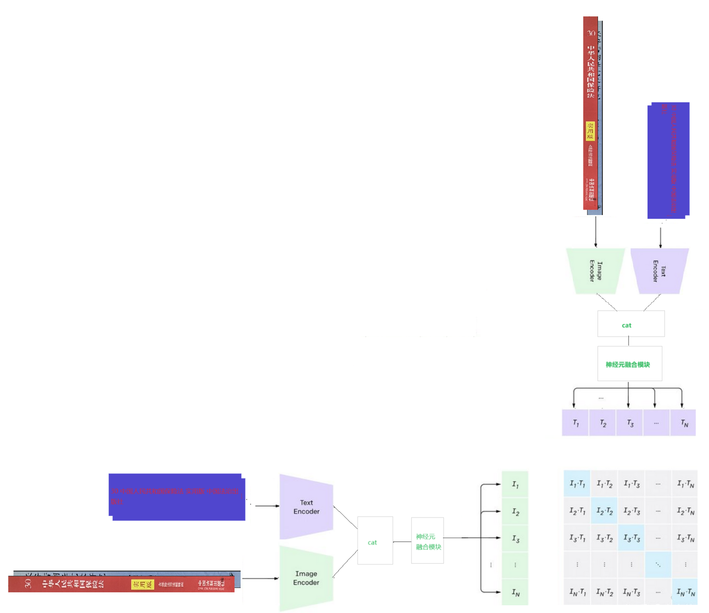

# 图文联合搜索 💻   
<h3> 🔥 Contrastive Language-img-Language-img-Pre-training , 简称CLI2P</h3>  

## 模型架构图  
<!--  -->

### TODO-LIST：
<!--  ✅ ❌ -->
- ✅ 模型搭建(可以在test_cli2p.ipynb中体验其前向传播) -----已经经过简单验证通过(还是个毛坯房)
- ✅ 数据加载单元 
- ✅ 模型训练代码 
- ✅ 模型损失代码  
- ✅ 模型推理代码 
- ❌ 模型转换代码      
- ❌ 引入faiss模块 
- ❌ 博客介绍

### 数据准备：
在该工程的根目录下建立一个 文件夹    
-datasets/   
------类型1/  
---------图像1  
---------图像1的ocr结果   
---------...   
---------图像n   
---------图像n的ocr结果   
------...   
------类型n/  
---------图像1  
---------图像1的ocr结果  
---------...   
---------图像n   
---------图像n的ocr结果  
